# RecetApp 👨‍🍳


**RecetApp** es una aplicación Android moderna para gestionar tus recetas favoritas de forma intuitiva y organizada. Guarda, busca, califica y comparte recetas con una interfaz elegante y funcional.

[](https://kotlinlang.org)
[](https://android.com)
[](https://developer.android.com/jetpack/androidx/releases/room)
[](LICENSE)

---

## 📋 Tabla de Contenidos

- [Características](#-características)
- [Capturas de Pantalla](#-capturas-de-pantalla)
- [Arquitectura](#-arquitectura)
- [Tecnologías Utilizadas](#-tecnologías-utilizadas)
- [Requisitos](#-requisitos)
- [Instalación](#-instalación)
- [Estructura del Proyecto](#-estructura-del-proyecto)
- [Uso](#-uso)
- [Base de Datos](#-base-de-datos)
- [Contribuir](#-contribuir)
- [Licencia](#-licencia)
- [Contacto](#-contacto)

---

## ✨ Características

### Gestión de Recetas
- ✅ **Crear, editar y eliminar recetas** con información detallada
- 🖼️ **Emojis personalizables** para identificar cada receta
- 📝 **Ingredientes y pasos de preparación** organizados
- ⏱️ **Tiempo de preparación, porciones y dificultad**
- 🏷️ **Categorías** (Mexicana, Italiana, Japonesa, Americana, Ensaladas, Postres, Sopas, Bebidas)

### Organización Avanzada
- ⭐ **Sistema de favoritos** para acceso rápido a tus recetas preferidas
- 📂 **Colecciones personalizadas** para agrupar recetas por temas
- 🏷️ **Tags/Etiquetas** con colores personalizables para clasificación flexible
- 🔍 **Búsqueda inteligente** por nombre de receta o ingredientes
- 📸 **Galería de fotos** para cada receta con soporte de URLs

### Interacción Social
- ⭐ **Sistema de calificaciones** con estrellas (1-5) y comentarios
- 📊 **Promedio de valoraciones** visible en cada receta
- 👥 **Reseñas de usuarios** con nombre, fecha y comentarios
- 💬 **Historial de reseñas** ordenadas cronológicamente

### Funcionalidades Adicionales
- 🛒 **Lista de compras interactiva** con checkboxes para marcar ingredientes
- 📤 **Compartir listas de compras** por cualquier aplicación
- 🔔 **Notificaciones y recordatorios** personalizados para recetas
- 👤 **Perfil de usuario** con estadísticas (total recetas, favoritos, categorías)
- 🌙 **Interfaz moderna** con Material Design 3
- 💾 **Almacenamiento local** con Room Database (offline-first)
- 🎨 **Temas personalizables** con paleta de colores naranja

---

## 📱 Capturas de Pantalla

### Pantallas Principales

| Splash Screen | Login | Home | Detalle Receta |
|---------------|-------|------|----------------|
| 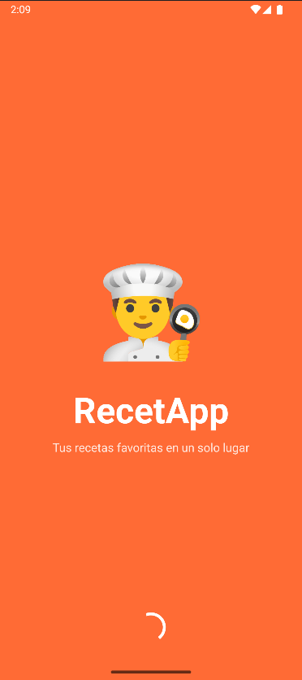 |  | 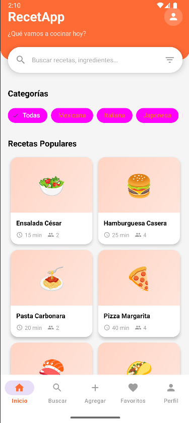 | 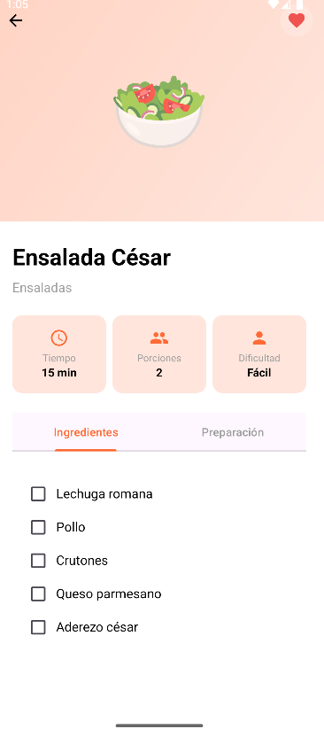 |

### Funcionalidades

| Búsqueda | Favoritos | Agregar Receta | Perfil |
|----------|-----------|----------------|--------|
| 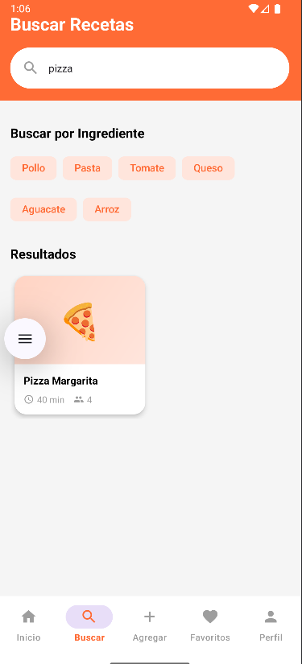 | 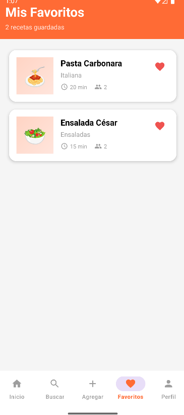 | 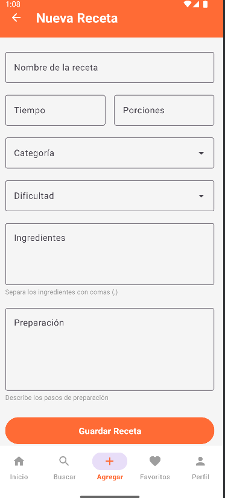 | 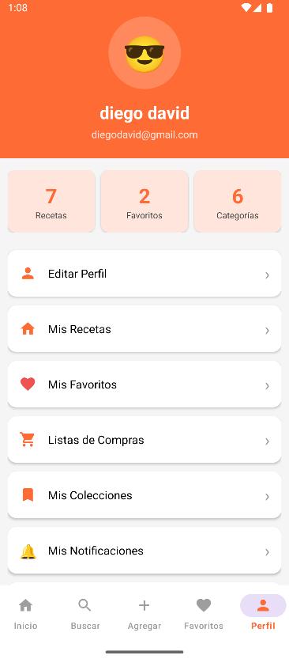 |

### Características Avanzadas

| Colecciones | Tags | Lista de Compras | Notificaciones |
|-------------|------|------------------|----------------|
| 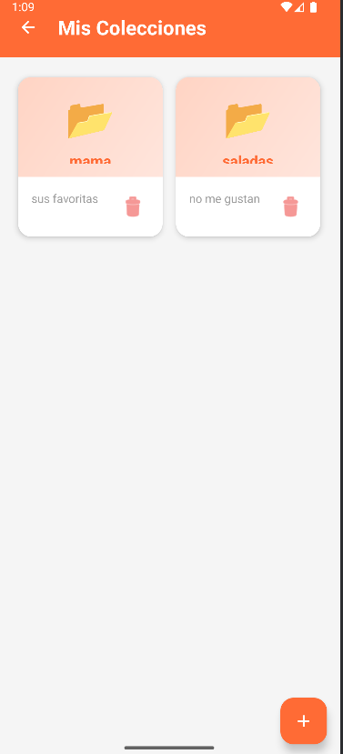 | 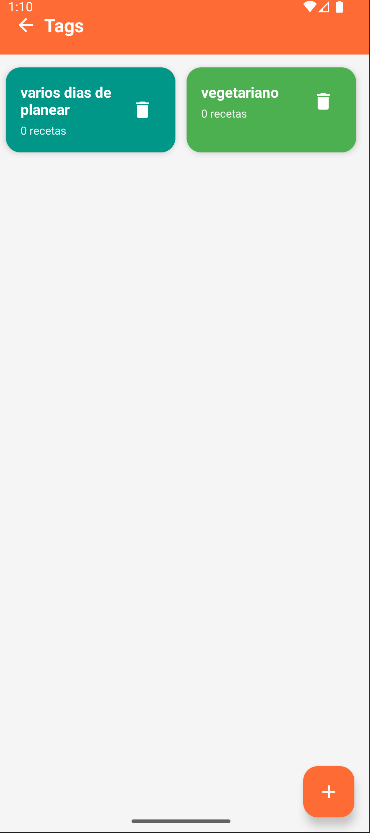 | 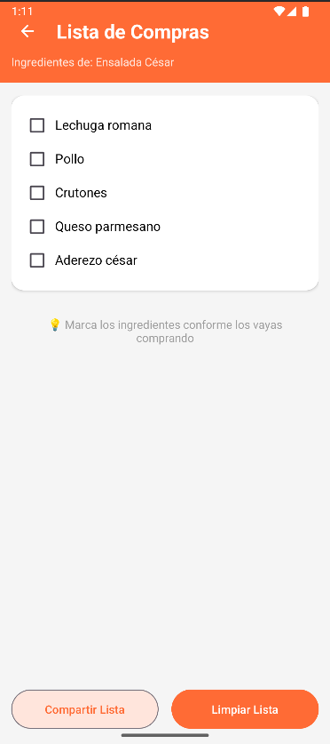 | 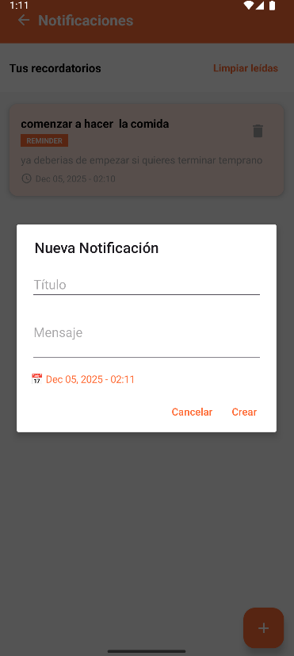 |


---

## 🏗️ Arquitectura

RecetApp sigue el patrón de arquitectura **MVVM (Model-View-ViewModel)** recomendado por Google para aplicaciones Android:
```
┌─────────────────────────────────────────────────────────┐
│                         UI Layer                         │
│  (Activities, Fragments, Adapters, XML Layouts)         │
└─────────────────┬───────────────────────────────────────┘
                  │
                  ▼
┌─────────────────────────────────────────────────────────┐
│                    ViewModel Layer                       │
│  (RecipeViewModel, CollectionViewModel, etc.)           │
│  - Gestiona lógica de presentación                      │
│  - Sobrevive a cambios de configuración                 │
└─────────────────┬───────────────────────────────────────┘
                  │
                  ▼
┌─────────────────────────────────────────────────────────┐
│                   Repository Layer                       │
│  (RecipeRepository, CollectionRepository, etc.)         │
│  - Abstracción de fuentes de datos                      │
└─────────────────┬───────────────────────────────────────┘
                  │
                  ▼
┌─────────────────────────────────────────────────────────┐
│                  Data Source Layer                       │
│     (Room Database - DAOs, Entities, Database)          │
│  - SQLite local con Room                                │
└─────────────────────────────────────────────────────────┘
```

### Componentes Principales

#### 1. **UI Layer** (`ui/`)
Contiene todas las Activities y Adapters:
- **Activities**: Pantallas de la aplicación (MainActivity, DetailActivity, etc.)
- **Adapters**: RecyclerView adapters para listas (RecipeAdapter, FavoriteAdapter, etc.)
- **ViewBinding**: Acceso seguro a vistas XML

#### 2. **ViewModel Layer** (`ui/*/ViewModel.kt`)
- Gestiona la lógica de presentación
- Mantiene el estado de la UI
- Sobrevive a cambios de configuración
- Ejemplo: `RecipeViewModel`, `CollectionViewModel`

#### 3. **Repository Layer** (`data/repository/`)
- Abstracción que proporciona datos a los ViewModels
- Encapsula la lógica de acceso a datos
- Permite cambiar fuentes de datos sin afectar UI

#### 4. **Data Source Layer** (`data/local/`)
- **Room Database**: Base de datos SQLite
- **DAOs**: Interfaces para operaciones CRUD
- **Entities**: Clases que representan tablas

---

## 🛠️ Tecnologías Utilizadas

### Core
- **Kotlin 2.0.21** - Lenguaje de programación principal
- **Android SDK 24+** - Compatible desde Android 7.0 (Nougat)
- **Material Design 3** - Componentes modernos de UI/UX
- **ViewBinding** - Binding seguro de vistas sin findViewById

### Jetpack Components
- **Room 2.6.0** - Base de datos local SQLite ORM
- **LiveData** - Observación de datos reactiva y lifecycle-aware
- **ViewModel** - Gestión de estado UI y lógica de presentación
- **Lifecycle 2.6.2** - Manejo consciente del ciclo de vida
- **KSP 2.0.21** - Kotlin Symbol Processing para anotaciones

### UI/UX Libraries
- **RecyclerView 1.3.2** - Listas eficientes y reciclables
- **CardView 1.0.0** - Tarjetas de Material Design
- **ViewPager2 1.0.0** - Navegación por pestañas con swipe
- **TabLayout** - Pestañas Material Design
- **ConstraintLayout 2.1.4** - Layouts flexibles y responsivos
- **Glide 4.16.0** - Carga asíncrona y caché de imágenes

### Build & Tools
- **Gradle 8.13** - Sistema de compilación
- **AGP 8.13.1** - Android Gradle Plugin
- **Kotlin Coroutines** - Programación asíncrona
- **SharedPreferences** - Almacenamiento de preferencias de usuario

---

## 📦 Requisitos

### Requisitos de Desarrollo
- **Android Studio** Hedgehog (2023.1.1) o superior
- **JDK 21** (Java Development Kit)
- **Gradle 8.13** o superior
- **SDK Tools**:
  - Build Tools 36.0.0
  - Platform Tools
  - Android SDK Platform 36

### Requisitos del Dispositivo/Emulador
- **API mínima**: 24 (Android 7.0 Nougat)
- **API objetivo**: 36 (Android 14)
- **Espacio**: ~50 MB libres
- **RAM**: Mínimo 2 GB recomendado
- **Permisos**: INTERNET (para futuras funciones de sincronización)

---

## 🚀 Instalación

### Opción 1: Clonar desde GitHub
```bash
# Clonar el repositorio
git clone https://github.com/1224100540cujl-commits/AppRecetasFinal.git

# Navegar al directorio del proyecto
cd RecetApp

# Abrir con Android Studio
# File > Open > Seleccionar carpeta RecetApp

# Esperar sincronización de Gradle
# Build > Make Project
```

### Opción 2: Descargar APK

1. Ve a la sección [Releases]
2. Descarga el archivo `RecetApp-v1.0.apk`
3. Transfiere el APK a tu dispositivo Android
4. Habilita instalación de fuentes desconocidas:
   - Configuración > Seguridad > Orígenes desconocidos
5. Instala el APK

### Opción 3: Compilar desde Código Fuente
```bash
# Clonar repositorio
git clone https://github.com/1224100540cujl-commits/AppRecetasFinal.git
cd RecetApp

# Compilar APK Debug
./gradlew assembleDebug

# El APK se generará en:
# app/build/outputs/apk/debug/app-debug.apk

# Compilar APK Release (requiere configuración de firma)
./gradlew assembleRelease
```

### Primera Ejecución

1. **Splash Screen** (3 segundos) - Pantalla de bienvenida con logo
2. **Registro/Login** - Crea tu cuenta con nombre, email y contraseña
3. **Recetas Precargadas** - La app incluye 6 recetas de ejemplo:
   - 🌮 Tacos al Pastor (Mexicana)
   - 🍝 Pasta Carbonara (Italiana)
   - 🍣 Sushi Rolls (Japonesa)
   - 🍔 Hamburguesa Casera (Americana)
   - 🥗 Ensalada César (Ensaladas)
   - 🍕 Pizza Margarita (Italiana)
4. **¡Listo!** - Explora la app y agrega tus propias recetas

---

## 📂 Estructura del Proyecto
```
RecetApp/
├── app/
│   ├── src/
│   │   ├── main/
│   │   │   ├── java/com/recetas/app/
│   │   │   │   ├── adapters/                    # RecyclerView Adapters
│   │   │   │   │   ├── RecipeAdapter.kt         # Adapter para lista de recetas
│   │   │   │   │   ├── FavoriteAdapter.kt       # Adapter para favoritos
│   │   │   │   │   ├── RatingAdapter.kt         # Adapter para calificaciones
│   │   │   │   │   ├── RecipeDetailPagerAdapter.kt # ViewPager2 tabs
│   │   │   │   │   ├── NotificationAdapter.kt   # Adapter de notificaciones
│   │   │   │   │   ├── RecipeMediaAdapter.kt    # Adapter de galería
│   │   │   │   │   ├── TagAdapter.kt            # Adapter de tags
│   │   │   │   │   └── CollectionAdapter.kt     # Adapter de colecciones
│   │   │   │   │
│   │   │   │   ├── data/
│   │   │   │   │   ├── local/
│   │   │   │   │   │   ├── dao/                 # Data Access Objects
│   │   │   │   │   │   │   ├── RecipeDao.kt     # CRUD de recetas
│   │   │   │   │   │   │   ├── RatingDao.kt     # CRUD de calificaciones
│   │   │   │   │   │   │   ├── CollectionDao.kt # CRUD de colecciones
│   │   │   │   │   │   │   ├── TagDao.kt        # CRUD de tags
│   │   │   │   │   │   │   ├── NotificationDao.kt # CRUD de notificaciones
│   │   │   │   │   │   │   └── RecipeMediaDao.kt # CRUD de media
│   │   │   │   │   │   │
│   │   │   │   │   │   └── database/
│   │   │   │   │   │       ├── AppDatabase.kt   # Configuración de Room DB
│   │   │   │   │   │       └── Converters.kt    # Type converters para Room
│   │   │   │   │   │
│   │   │   │   │   ├── model/                   # Data Models (Entities)
│   │   │   │   │   │   ├── Recipe.kt            # Entity: Receta
│   │   │   │   │   │   ├── Rating.kt            # Entity: Calificación
│   │   │   │   │   │   ├── Tag.kt               # Entity: Etiqueta
│   │   │   │   │   │   ├── RecipeTag.kt         # Entity: Relación M-N
│   │   │   │   │   │   ├── RecipeCollection.kt  # Entity: Colección
│   │   │   │   │   │   ├── RecipeCollectionItem.kt # Entity: Item colección
│   │   │   │   │   │   ├── Notification.kt      # Entity: Notificación
│   │   │   │   │   │   └── RecipeMedia.kt       # Entity: Media de receta
│   │   │   │   │   │
│   │   │   │   │   └── repository/              # Data Repositories
│   │   │   │   │       ├── RecipeRepository.kt  # Repositorio de recetas
│   │   │   │   │       ├── RatingRepository.kt  # Repositorio de ratings
│   │   │   │   │       ├── CollectionRepository.kt
│   │   │   │   │       ├── TagRepository.kt
│   │   │   │   │       ├── NotificationRepository.kt
│   │   │   │   │       └── RecipeMediaRepository.kt
│   │   │   │   │
│   │   │   │   └── ui/                          # UI Layer
│   │   │   │       ├── add/                     # Agregar/Editar Recetas
│   │   │   │       │   ├── AddRecipeActivity.kt
│   │   │   │       │   └── EditRecipeActivity.kt
│   │   │   │       │
│   │   │   │       ├── auth/                    # Autenticación
│   │   │   │       │   ├── SplashActivity.kt    # Pantalla de bienvenida
│   │   │   │       │   ├── LoginActivity.kt     # Login con validación
│   │   │   │       │   └── RegisterActivity.kt  # Registro de usuario
│   │   │   │       │
│   │   │   │       ├── collections/             # Colecciones de Recetas
│   │   │   │       │   ├── CollectionsActivity.kt
│   │   │   │       │   ├── CollectionDetailActivity.kt
│   │   │   │       │   └── CollectionViewModel.kt
│   │   │   │       │
│   │   │   │       ├── detail/                  # Detalle de Receta
│   │   │   │       │   ├── DetailActivity.kt    # Vista detallada con tabs
│   │   │   │       │   └── RatingViewModel.kt   # VM para calificaciones
│   │   │   │       │
│   │   │   │       ├── favorites/               # Favoritos
│   │   │   │       │   └── FavoritesActivity.kt
│   │   │   │       │
│   │   │   │       ├── home/                    # Pantalla Principal
│   │   │   │       │   ├── MainActivity.kt      # Activity principal
│   │   │   │       │   ├── RecipeViewModel.kt   # ViewModel principal
│   │   │   │       │   └── CategoriesActivity.kt # Vista por categoría
│   │   │   │       │
│   │   │   │       ├── media/                   # Galería de Fotos
│   │   │   │       │   ├── RecipeMediaActivity.kt
│   │   │   │       │   └── RecipeMediaViewModel.kt
│   │   │   │       │
│   │   │   │       ├── notifications/           # Notificaciones
│   │   │   │       │   ├── NotificationsActivity.kt
│   │   │   │       │   └── NotificationViewModel.kt
│   │   │   │       │
│   │   │   │       ├── profile/                 # Perfil de Usuario
│   │   │   │       │   ├── ProfileActivity.kt   # Perfil con estadísticas
│   │   │   │       │   └── EditProfileActivity.kt
│   │   │   │       │
│   │   │   │       ├── search/                  # Búsqueda
│   │   │   │       │   └── SearchActivity.kt    # Búsqueda en tiempo real
│   │   │   │       │
│   │   │   │       ├── shopping/                # Lista de Compras
│   │   │   │       │   └── ShoppingListActivity.kt
│   │   │   │       │
│   │   │   │       └── tags/                    # Tags/Etiquetas
│   │   │   │           ├── TagsActivity.kt
│   │   │   │           └── TagViewModel.kt
│   │   │   │
│   │   │   ├── res/
│   │   │   │   ├── drawable/                    # Iconos y recursos gráficos
│   │   │   │   │   ├── ic_*.xml                 # Iconos vectoriales
│   │   │   │   │   ├── bg_*.xml                 # Backgrounds
│   │   │   │   │   └── chip_*.xml               # Chips personalizados
│   │   │   │   │
│   │   │   │   ├── layout/                      # Archivos XML de layouts
│   │   │   │   │   ├── activity_*.xml           # Layouts de Activities
│   │   │   │   │   ├── item_*.xml               # Items de RecyclerView
│   │   │   │   │   └── tab_*.xml                # Tabs de ViewPager
│   │   │   │   │
│   │   │   │   ├── menu/                        # Menús
│   │   │   │   │   └── bottom_nav_menu.xml      # Bottom Navigation
│   │   │   │   │
│   │   │   │   ├── mipmap/                      # Launcher icons
│   │   │   │   │   └── ic_launcher*.png
│   │   │   │   │
│   │   │   │   └── values/                      # Valores y recursos
│   │   │   │       ├── colors.xml               # Paleta de colores
│   │   │   │       ├── strings.xml              # Textos en español
│   │   │   │       └── themes.xml               # Temas Material Design
│   │   │   │
│   │   │   └── AndroidManifest.xml              # Manifest con permisos
│   │   │
│   │   └── build.gradle.kts                     # Configuración del módulo
│   │
│   └── proguard-rules.pro                       # Reglas de ofuscación
│
├── docs/
│   └── screenshots/                             # Capturas de pantalla
│       ├── banner.png
│       ├── splash.png
│       ├── login.png
│       ├── home.png
│       ├── detail.png
│       ├── search.png
│       ├── favorites.png
│       ├── add_recipe.png
│       ├── profile.png
│       ├── collections.png
│       ├── tags.png
│       ├── shopping_list.png
│       └── notifications.png
│
├── gradle/
│   ├── libs.versions.toml                       # Catálogo de versiones
│   └── wrapper/
│       └── gradle-wrapper.properties
│
├── .gitignore                                   # Archivos ignorados por Git
├── build.gradle.kts                             # Build script raíz
├── settings.gradle.kts                          # Configuración de Gradle
├── gradlew                                      # Gradle wrapper (Linux/Mac)
├── gradlew.bat                                  # Gradle wrapper (Windows)
├── LICENSE                                      # Licencia MIT
└── README.md                                    # Este archivo
```

### Descripción de Directorios Principales

#### **`adapters/`**
Contiene todos los adaptadores de RecyclerView para mostrar listas:
- `RecipeAdapter`: Lista principal de recetas en grid
- `FavoriteAdapter`: Lista de recetas favoritas con opción de eliminar
- `RatingAdapter`: Lista de reseñas con estrellas y comentarios
- `RecipeDetailPagerAdapter`: Tabs de ingredientes e instrucciones

#### **`data/local/dao/`**
Interfaces DAO (Data Access Objects) con métodos de consulta Room:
- Operaciones CRUD (Create, Read, Update, Delete)
- Consultas personalizadas con SQL
- LiveData para observación reactiva

#### **`data/model/`**
Entidades de Room (tablas de base de datos):
- Anotaciones `@Entity`, `@PrimaryKey`, `@ColumnInfo`
- Relaciones uno-a-muchos y muchos-a-muchos
- Data classes de Kotlin

#### **`data/repository/`**
Capa de abstracción entre ViewModels y DAOs:
- Encapsula lógica de acceso a datos
- Permite testing más fácil
- Facilita cambios de fuentes de datos

#### **`ui/`**
Todas las Activities organizadas por funcionalidad:
- Cada módulo tiene su propio subdirectorio
- ViewModels en el mismo paquete que sus Activities
- Separación clara de responsabilidades

---

## 💡 Uso

### 1. Gestión de Recetas

#### Crear una Nueva Receta

1. Toca el botón **"+"** en la barra de navegación inferior
2. Completa los campos obligatorios:
✓ Nombre de la receta (ej: "Tacos al Pastor")
✓ Emoji representativo (toca el área de imagen para elegir)
✓ Tiempo de preparación (ej: "30 min")
✓ Número de porciones (ej: 4)
✓ Categoría (selecciona del dropdown)
✓ Dificultad (Fácil, Media, Difícil)
✓ Ingredientes (separados por comas)
✓ Pasos de preparación
3. Toca **"Guardar Receta"**
4. La receta aparecerá inmediatamente en el inicio

#### Editar una Receta Existente

1. Abre una receta desde el inicio o búsqueda
2. Toca el botón **"Editar"** en la pantalla de detalle
3. Modifica los campos necesarios
4. Toca **"Guardar Cambios"**
5. Para eliminar: toca el icono de papelera y confirma

#### Ver Detalle de Receta

La pantalla de detalle incluye:
- **Header**: Emoji grande, nombre y categoría
- **Info Cards**: Tiempo, porciones y dificultad
- **Tabs**:
  - **Ingredientes**: Lista con checkboxes
  - **Preparación**: Pasos numerados
- **Reseñas**: Promedio de estrellas y comentarios
- **Acciones**:
  - ❤️ Agregar a favoritos
  - ⭐ Calificar receta
  - 🏷️ Gestionar tags
  - 🔔 Crear recordatorio
  - 📸 Galería de fotos
  - 🛒 Lista de compras
  - ✏️ Editar receta

---

### 2. Búsqueda y Filtrado

#### Búsqueda por Texto

1. Toca **"Buscar"** en la navegación inferior
2. Escribe en el campo de búsqueda:
   - Busca por nombre: "Tacos"
   - Busca por ingrediente: "Pollo", "Tomate"
3. Los resultados se filtran en tiempo real
4. Toca cualquier receta para ver detalles

#### Búsqueda por Ingredientes

La app incluye chips predefinidos:
- 🍗 Pollo
- 🍝 Pasta
- 🍅 Tomate
- 🧀 Queso
- 🥑 Aguacate
- 🍚 Arroz

Toca cualquier chip para buscar recetas que contengan ese ingrediente.

#### Filtrar por Categoría

1. En la pantalla de inicio, desliza horizontalmente las categorías
2. Selecciona una categoría específica:
   - 🌮 Mexicana
   - 🍕 Italiana
   - 🍣 Japonesa
   - 🍔 Americana
   - 🥗 Ensaladas
   - 🍰 Postres
   - 🍲 Sopas
   - 🥤 Bebidas
3. Se abre una vista con todas las recetas de esa categoría

---

### 3. Sistema de Favoritos

#### Agregar a Favoritos

1. Abre una receta
2. Toca el icono de corazón ❤️ en la toolbar
3. El corazón se vuelve rojo = agregado a favoritos

#### Ver Favoritos

1. Toca **"Favoritos"** en la navegación inferior
2. Verás todas tus recetas favoritas en una lista
3. Cada item muestra:
   - Emoji de la receta
   - Nombre
   - Categoría
   - Tiempo de preparación
   - Número de porciones
   - Botón para eliminar de favoritos

#### Eliminar de Favoritos

**Opción 1**: Desde la lista de favoritos
- Toca el icono de corazón rojo en el item

**Opción 2**: Desde el detalle
- Toca el corazón rojo en la toolbar

---

### 4. Colecciones

Las colecciones te permiten agrupar recetas por temas personalizados.

#### Crear una Colección

1. Ve a **Perfil > Mis Colecciones**
2. Toca el botón **"+"** flotante
3. Ingresa:
   - Nombre (ej: "Postres para Navidad")
   - Descripción opcional
4. Toca **"Crear"**

#### Agregar Recetas a una Colección

1. Abre la colección
2. Toca el botón **"+"** flotante
3. Selecciona recetas de tu lista
4. Confirma para agregar

#### Gestionar Colecciones

- **Ver recetas**: Toca una colección para ver sus recetas
- **Eliminar receta**: Toca el icono de eliminar en cada receta
- **Eliminar colección**: Toca el icono de papelera en la lista

---

### 5. Sistema de Tags/Etiquetas

Los tags permiten clasificación cruzada de recetas.

#### Crear Tags

1. Ve a **Perfil > Mis Tags**
2. Toca el botón **"+"** flotante
3. Escribe el nombre del tag (ej: "Vegetariano", "Bajo en Calorías")
4. El color se asigna automáticamente
5. Toca **"Crear"**

#### Asignar Tags a Recetas

1. Abre una receta
2. Toca **"🏷️ Gestionar Tags"**
3. Marca/desmarca los tags deseados
4. Los tags aparecen inmediatamente debajo del nombre

#### Ver Recetas por Tag

1. Ve a **Perfil > Mis Tags**
2. Cada tag muestra el número de recetas asociadas
3. Toca un tag para ver todas sus recetas (próximamente)

---

### 6. Calificaciones y Reseñas

#### Calificar una Receta

1. Abre una receta
2. Toca "⭐ Calificar Receta"
3. Selecciona estrellas (1-5)
4. Escribe un comentario opcional
5. Toca "Enviar"
Ver Reseñas

Las reseñas aparecen en la parte inferior del detalle
Cada reseña muestra:

Avatar del usuario
Nombre
Calificación con estrellas
Comentario
Tiempo transcurrido ("Hace 2 días")


Promedio de Calificaciones

Se muestra en un card destacado
Incluye:

Número grande con el promedio
Barra de estrellas visual
Conteo total de reseñas


7. Lista de Compras
Generar Lista de Compras

Abre una receta
Toca "🛒 Lista de Compras"
Se abre automáticamente con todos los ingredientes

Usar la Lista

Marcar ingredientes: Toca el checkbox al comprar
Limpiar lista: Toca "Limpiar Lista" para desmarcar todo
Compartir: Toca "Compartir Lista" para enviar por:

WhatsApp
Email
Mensajes
Cualquier app de compartir


Formato de lista compartida:
🛒 Lista de Compras
Receta: Tacos al Pastor

Ingredientes:
⬜ Carne de cerdo
⬜ Piña
✅ Tortillas (marcado)
⬜ Cilantro

8. Notificaciones y Recordatorios
Crear Recordatorio para Receta

Abre una receta
Toca "🔔 Crear Recordatorio"
Configura:

Mensaje personalizado
Fecha (selector de calendario)
Hora (selector de hora)


Toca "Crear"

Ver Notificaciones

Ve a Perfil > Mis Notificaciones
Verás todas las notificaciones:

No leídas: Fondo naranja
Leídas: Fondo blanco


Toca una notificación para marcarla como leída

Gestionar Notificaciones

Eliminar individual: Toca el icono de papelera
Limpiar leídas: Toca "Limpiar leídas" en la parte superior


9. Galería de Fotos
Agregar Fotos a una Receta

Abre una receta
Toca "📸 Galería de Fotos"
Toca el botón "+" flotante
Ingresa:

URL de la imagen
Tipo (📸 Foto o 🎥 Video)


Toca "Agregar"

Nota: Actualmente solo soporta URLs públicas de imágenes.
Ver Galería

Las fotos se muestran en tarjetas
Toca una foto para verla en grande
Cada foto muestra:

Imagen en miniatura
Tipo (PHOTO/VIDEO)
URL
Botón para eliminar


10. Perfil de Usuario
Estadísticas
Tu perfil muestra automáticamente:

📊 Total de Recetas creadas
❤️ Total de Favoritos
🏷️ Categorías Únicas utilizadas

Editar Perfil

Ve a Perfil > Editar Perfil
Modifica:

Nombre
Avatar (emoji)
Contraseña (opcional)


El correo no se puede modificar
Toca "Guardar Cambios"

Opciones del Perfil
Desde el perfil puedes acceder a:

✏️ Editar Perfil
🏠 Mis Recetas
❤️ Mis Favoritos
🛒 Listas de Compras
📂 Mis Colecciones
🔔 Mis Notificaciones
🏷️ Mis Tags
🚪 Cerrar Sesión


🗄️ Base de Datos
RecetApp utiliza Room Database, una capa de abstracción sobre SQLite que proporciona:

Verificación de consultas en tiempo de compilación
Menos código boilerplate
Integración con LiveData y Coroutines

Esquema de Base de Datos
La aplicación utiliza 8 tablas principales:
1. recipes - Recetas
kotlin@Entity(tableName = "recipes")
data class Recipe(
    @PrimaryKey(autoGenerate = true)
    val id: Int = 0,
    val name: String,              // Nombre de la receta
    val category: String,          // Categoría (Mexicana, Italiana, etc.)
    val time: String,              // Tiempo de preparación
    val servings: Int,             // Número de porciones
    val difficulty: String,        // Fácil, Media, Difícil
    val ingredients: String,       // Ingredientes separados por comas
    val instructions: String,      // Pasos de preparación
    val imageUrl: String?,         // URL o emoji
    val isFavorite: Boolean = false // Estado de favorito
)
Consultas principales:

getAllRecipes(): Todas las recetas ordenadas por nombre
getRecipeById(id): Receta específica
getFavorites(): Solo recetas favoritas
searchRecipes(query): Búsqueda por nombre
getRecipesByCategory(category): Filtrar por categoría

2. ratings - Calificaciones
kotlin@Entity(tableName = "ratings")
data class Rating(
    @PrimaryKey(autoGenerate = true)
    val id: Int = 0,
    val recipeId: Int,             // FK a recipes
    val userName: String,          // Nombre del usuario
    val stars: Int,                // 1-5 estrellas
    val comment: String,           // Comentario opcional
    val createdAt: Long            // Timestamp de creación
)
Relación:

Muchos-a-Uno con recipes (una receta tiene muchas calificaciones)

Consultas:

getRatingsByRecipe(recipeId): Todas las calificaciones de una receta
getAverageRating(recipeId): Promedio de estrellas
getRatingsCount(recipeId): Total de calificaciones

3. recipe_collections - Colecciones
kotlin@Entity(tableName = "recipe_collections")
data class RecipeCollection(
    @PrimaryKey(autoGenerate = true)
    val id: Int = 0,
    val name: String,              // Nombre de la colección
    val description: String,       // Descripción opcional
    val createdAt: Long            // Timestamp de creación
)
4. recipe_collection_items - Items de Colección
kotlin@Entity(tableName = "recipe_collection_items")
data class RecipeCollectionItem(
    @PrimaryKey(autoGenerate = true)
    val id: Int = 0,
    val collectionId: Int,         // FK a recipe_collections
    val recipeId: Int,             // FK a recipes
    val addedAt: Long              // Timestamp de agregado
)
Relación:

Tabla intermedia para relación Muchos-a-Muchos entre colecciones y recetas

5. tags - Etiquetas
kotlin@Entity(tableName = "tags")
data class Tag(
    @PrimaryKey(autoGenerate = true)
    val id: Int = 0,
    val name: String,              // Nombre del tag
    val color: String = "#FF6B35"  // Color en formato HEX
)
6. recipe_tags - Relación Recetas-Tags
kotlin@Entity(
    tableName = "recipe_tags",
    primaryKeys = ["recipeId", "tagId"]
)
data class RecipeTag(
    val recipeId: Int,             // FK a recipes
    val tagId: Int                 // FK a tags
)
Relación:

Muchos-a-Muchos entre recetas y tags

Consultas:

getTagsForRecipe(recipeId): Todos los tags de una receta
isRecipeTagged(recipeId, tagId): Verificar si tiene tag
getRecipeCountForTag(tagId): Contar recetas con ese tag

7. notifications - Notificaciones
kotlin@Entity(tableName = "notifications")
data class Notification(
    @PrimaryKey(autoGenerate = true)
    val id: Int = 0,
    val title: String,             // Título de la notificación
    val message: String,           // Mensaje
    val triggerTime: Date,         // Fecha/hora programada
    val type: String,              // Tipo (REMINDER, etc.)
    var isRead: Boolean,           // Estado de lectura
    val createdAt: Date            // Fecha de creación
)
Consultas:

getAllNotifications(): Todas ordenadas por fecha
getUnreadNotifications(): Solo no leídas
getUnreadCount(): Contar no leídas
markAsRead(id): Marcar como leída

8. recipe_media - Galería de Fotos
kotlin@Entity(tableName = "recipe_media")
data class RecipeMedia(
    @PrimaryKey(autoGenerate = true)
    val id: Int = 0,
    val recipeId: Int,             // FK a recipes
    val url: String,               // URL de la imagen/video
    val type: String,              // PHOTO o VIDEO
    val order: Int,                // Orden de visualización
    val createdAt: Long            // Timestamp de creación
)
```

**Relación:**
- Uno-a-Muchos con `recipes` (una receta tiene muchas fotos)

---

### Diagrama de Relaciones
```
┌─────────────┐
│   recipes   │◄──────┐
└──────┬──────┘       │
       │              │
       │ 1:N          │ N:M
       │              │
┌──────▼──────┐  ┌────┴─────────┐
│   ratings   │  │ recipe_tags  │
└─────────────┘  └────┬─────────┘
                      │
                      │ N:M
                      │
                 ┌────▼──┐
                 │ tags  │
                 └───────┘

┌─────────────┐
│   recipes   │◄──────────────┐
└──────┬──────┘               │
       │                      │ N:M
       │ 1:N                  │
       │                 ┌────┴──────────────────┐
┌──────▼──────────┐     │ recipe_collection_    │
│ recipe_media    │     │ items                 │
└─────────────────┘     └────┬──────────────────┘
                             │
                             │ N:1
                             │
                    ┌────────▼────────────┐
                    │ recipe_collections  │
                    └─────────────────────┘

Migraciones
El proyecto está configurado con:
kotlin.fallbackToDestructiveMigration()
Esto significa que cualquier cambio en el esquema eliminará y recreará la base de datos. En producción, se deberían implementar migraciones adecuadas:
kotlinval MIGRATION_1_2 = object : Migration(1, 2) {
    override fun migrate(database: SupportSQLiteDatabase) {
        database.execSQL("ALTER TABLE recipes ADD COLUMN new_column TEXT")
    }
}

Type Converters
Para manejar tipos personalizados en Room:
kotlinclass Converters {
    @TypeConverter
    fun fromTimestamp(value: Long?): Date? {
        return value?.let { Date(it) }
    }

    @TypeConverter
    fun dateToTimestamp(date: Date?): Long? {
        return date?.time
    }
}
Esto permite almacenar objetos Date como Long en SQLite.

🤝 Contribuir
¡Las contribuciones son bienvenidas! Si deseas mejorar RecetApp, sigue estos pasos:
1. Fork del Repositorio
bash# Haz clic en "Fork" en GitHub
# Luego clona tu fork
git clone https://github.com/1224100540cujl-commits/AppRecetasFinal.git
cd RecetApp
2. Crear una Rama
bash# Crea una rama para tu feature o bugfix
git checkout -b feature/nueva-funcionalidad

# O para un bugfix
git checkout -b fix/corregir-bug
3. Hacer Cambios

Escribe código limpio y bien documentado
Sigue las convenciones de Kotlin
Agrega comentarios KDoc para funciones públicas
Asegúrate de que compila sin errores

4. Commit y Push
bash# Agrega tus cambios
git add .

# Commit con mensaje descriptivo
git commit -m "feat: agregar búsqueda por tags"

# Push a tu fork
git push origin feature/nueva-funcionalidad
5. Pull Request

Ve a tu fork en GitHub
Haz clic en "Pull Request"
Describe tus cambios detalladamente
Espera revisión y feedback


Convenciones de Código
Nombres de Archivos

Activities: *Activity.kt (ej: MainActivity.kt)
ViewModels: *ViewModel.kt (ej: RecipeViewModel.kt)
Adapters: *Adapter.kt (ej: RecipeAdapter.kt)
Fragments: *Fragment.kt

Comentarios KDoc
kotlin/**
 * Inserta una nueva receta en la base de datos.
 *
 * @param recipe La receta a insertar
 * @return El ID de la receta insertada
 * @throws SQLException Si hay un error en la inserción
 */
@Insert
suspend fun insert(recipe: Recipe): Long
```

#### Estilo de Código
- Indentación: 4 espacios
- Líneas: máximo 120 caracteres
- Imports: organizar alfabéticamente
- Nombres: camelCase para funciones, PascalCase para clases

---

### Áreas de Mejora

Algunas ideas para contribuir:

#### Funcionalidades
- [ ] Sincronización con Firebase
- [ ] Modo offline completo
- [ ] Export/Import de recetas (JSON)
- [ ] Widget para la pantalla de inicio
- [ ] Modo oscuro
- [ ] Soporte multiidioma (inglés, francés)
- [ ] Integración con APIs de recetas
- [ ] Temporizador de cocina integrado
- [ ] Conversor de unidades de medida
- [ ] Planificador semanal de menús

#### Mejoras UI/UX
- [ ] Animaciones más fluidas
- [ ] Transiciones entre pantallas
- [ ] Gestos swipe para acciones rápidas
- [ ] Tutorial inicial para nuevos usuarios
- [ ] Mejores placeholders y estados vacíos

#### Testing
- [ ] Unit tests para ViewModels
- [ ] UI tests con Espresso
- [ ] Integration tests para Room
- [ ] Tests de navegación

#### Performance
- [ ] Paginación en listas largas
- [ ] Caché de imágenes mejorado
- [ ] Reducir tamaño del APK
- [ ] Optimizar consultas de Room

---

## 📄 Licencia

Este proyecto está licenciado bajo la **Licencia MIT**.
```
MIT License

Copyright (c) 2025 Cristian Uriel Juarez Lopez y Diego David del Angel Sanchez - RecetApp

Permission is hereby granted, free of charge, to any person obtaining a copy
of this software and associated documentation files (the "Software"), to deal
in the Software without restriction, including without limitation the rights
to use, copy, modify, merge, publish, distribute, sublicense, and/or sell
copies of the Software, and to permit persons to whom the Software is
furnished to do so, subject to the following conditions:

The above copyright notice and this permission notice shall be included in all
copies or substantial portions of the Software.

THE SOFTWARE IS PROVIDED "AS IS", WITHOUT WARRANTY OF ANY KIND, EXPRESS OR
IMPLIED, INCLUDING BUT NOT LIMITED TO THE WARRANTIES OF MERCHANTABILITY,
FITNESS FOR A PARTICULAR PURPOSE AND NONINFRINGEMENT. IN NO EVENT SHALL THE
AUTHORS OR COPYRIGHT HOLDERS BE LIABLE FOR ANY CLAIM, DAMAGES OR OTHER
LIABILITY, WHETHER IN AN ACTION OF CONTRACT, TORT OR OTHERWISE, ARISING FROM,
OUT OF OR IN CONNECTION WITH THE SOFTWARE OR THE USE OR OTHER DEALINGS IN THE
SOFTWARE.

📧 Contacto
Desarrolladores

Cristian y David
GitHub: @1224100540cujl-commits  @crizzz77

Links del Proyecto

Repositorio: https://github.com/1224100540cujl-commits/AppRecetasFinal.git

Reportar Bugs
Si encuentras un bug, por favor:

Descripción clara del problema
Pasos para reproducir
Capturas de pantalla (si aplica)
Versión de Android
Modelo de dispositivo

🙏 Agradecimientos

Material Design 3 por los componentes UI modernos
Google Jetpack por las librerías de arquitectura
Kotlin por el lenguaje maravilloso
Android Developers por la excelente documentación
Comunidad de Stack Overflow por resolver dudas
Todos los contribuidores que hacen posible este proyecto

Hecho con ❤️ y ☕ por Cristian y David
Si te gusta el proyecto, ¡dale una ⭐ en GitHub!
